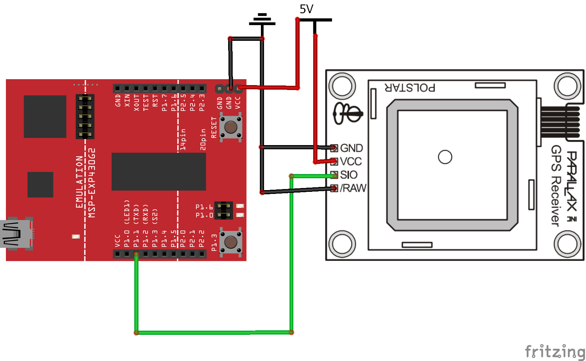
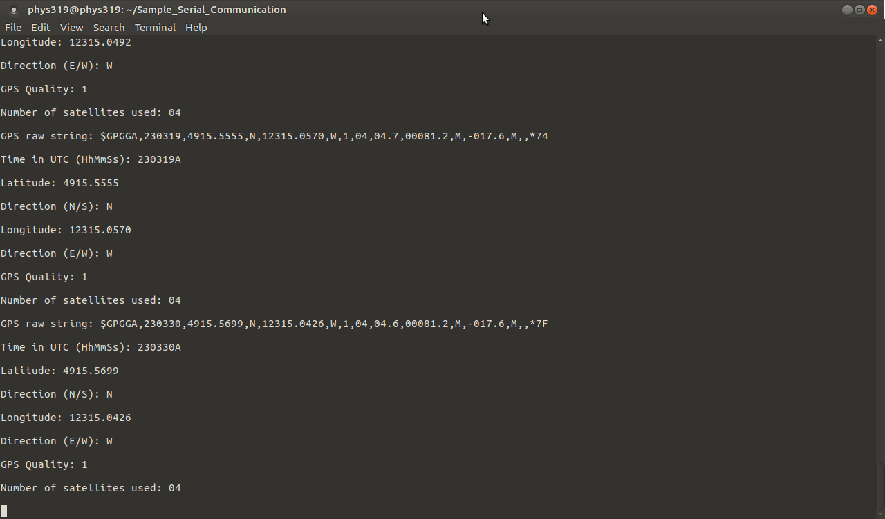

# GPS-Tracker-MSP430
This project builds a GPS tracker to track time, latitude and longitude anywhere at any time. The GPS tracker uses MSP430, a microcontroller with super low power consumption, to receive GPS data from a Parallax GPS Receiver and to transmit the parsed results to a host computer for display. Users can utilize this GPS tracker anywhere outdoor to obtain high-precision GPS positional information.

### Apparatus

List of components: Parallax GPS Receiver 28146, breadboard, MSP430G2 (Rev. 1.5)

The components of the GPS tracker is connected in Figure 1. The SIO pin of the GPS module is connected to P1.1 in MSP430 for GPS data transmission, and the /RAW pin is grounded for automatic data transmission.

**Figure 1: Connection between Parallax GPS Receiver and MSP430**




### How It Works

The Parallax GPS Receiver is based on the PMB-248 specification and provides standard raw NMEA01823 strings via the serial command interface. It can track up to 12 satellites. NMEA0183 is a combined hardware and logic specification for communication between marine electronic devices such as sonars, anemometers, and many others including GPS.

The module provides current time, date, latitude, longitude, altitude speed, and travel direction/heading, among other data.

The GPS module connects to the MSP430 through a 4800 bps TTL-level interface (8 data bits, no parity, 1 stop bit, non-inverted). One can write data to the GPS modules in order to request specific strings. However, when the /RAW pin of the GPS module is pulled low, the raw GPS strings are automatically transmitted from the SIO pin of the GPS module to P1.1 in MSP430. These strings are:

- $GPGGA: Global Positioning System Fix Data
- $GPGSV: GPS satellites in view
- $GPGSA: GPS DOP and active satellites
- $GPRMC: Recommended minimum specific GPS/Transit data

This project mainly focuses on the longitude and latitude data, so $GPGGA string is used to extract relevant information.

Here is an example of the $GPGGA string:

```
$GPGGA,172814.0,3723.46587704,N,12202.26957864,W, 2,6,1.2,18.893,M,-25.669,M,2.0,0031*4F
```

Table 1 shows the meaning of each message field:

**Table 1: Message field of $GPGGA string [1]**


This GPS tracker focuses on the first seven message fields since they are the most important ones. Once the GPS module starts transmitting valid GSP raw strings, the GPS parser program searches for the $GPGGA string, parses the first seven fields, and send these data to the host computer via the USB cable. After receiving the parsed results, the host computer then uses a Python program to print relevant information to the terminal. This procedure repeats every ten seconds. The GPS parser C program and the Python program used by the GPS tracker can be found in the `src` directory.

### Sample Output

**Figure 2: Sample output from the Python program**

